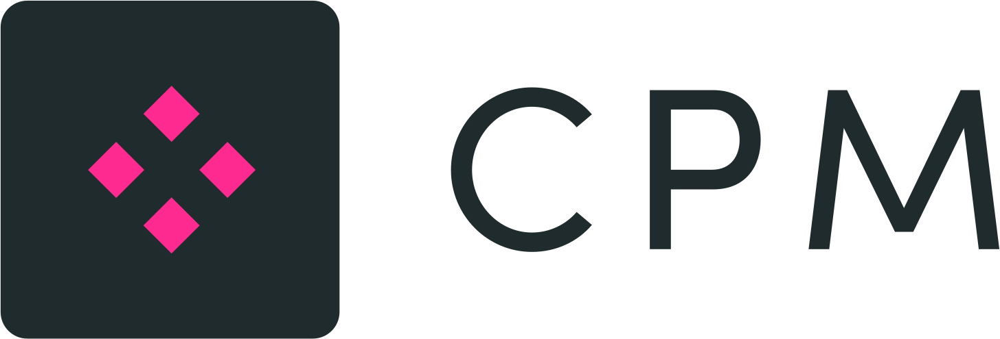

<p align="center">
  
</p>

CPM
---
A commandline tool for developing and interacting with smart contracts that 
* can download 3rd party smart contracts and state from your target network (e.g. MainNet) to your neo-express network to
create a realistic test environment.
* can generate on-chain and off-chain SDKs based of the smart contract manifest for C#, Golang, Java, Python & TS
  (see the CLI help for details).


# Installation
Download the binary from the releases page and place it somewhere on your path, or 

## OSX (brew)
```shell
brew install CityOfZion/tap/cpm
```

## Windows (Chocolatey)
```shell
choco install cpm
```

# Usage

```shell
cpm -h
```

`cpm.yaml` is your project configuration file. Have a look or read more about it [here](docs/config.md).

## Example commands

### Download all contracts listed in `cpm.yaml`
Note that only `neo-express` is supported as destination chain. An [issue](https://github.com/nspcc-dev/neo-go/issues/2406) for `neo-go` to add support exists (go vote!).

```shell
cpm --log-level DEBUG run 
```

### Download a single contract or contract manifest
```shell
cpm download contract -c 0x4380f2c1de98bb267d3ea821897ec571a04fe3e0 -n mainnet
cpm download manifest -c 0x4380f2c1de98bb267d3ea821897ec571a04fe3e0 -N https://mainnet1.neo.coz.io:443
```

### Build SDK from local manifest
```shell
cpm generate python -m samplecontract.manifest.json -t offchain
cpm generate go -m samplecontract.manifest.json -t onchain
```
Note: all the SDKs are placed in `/cpm_out/` under a SDK type and language specific folder i.e. `/cpm_out/offchain/python/<contract>` or `/cpm_out/onchain/golang/<contract>`
